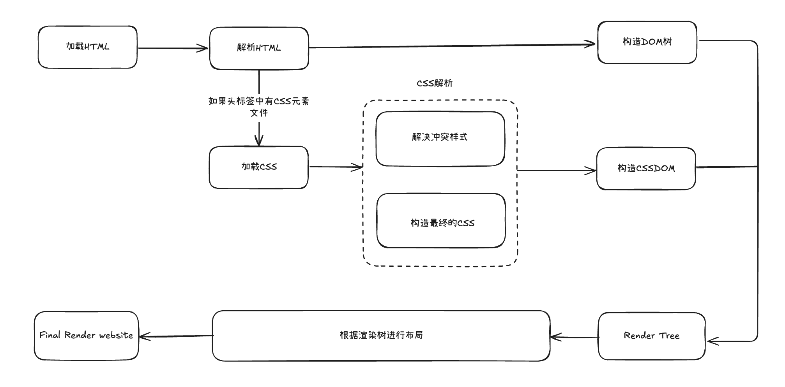
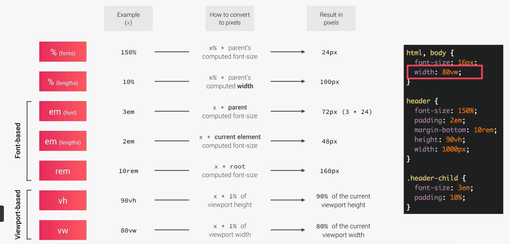

# Advance CSS and SASS

## What happens to CSS when we load up a website?

## Priority

对于声明。

1. User !important declarations
2. Author !important declarations
3. Author declarations
4. User declarations
5. Default browser declarations

对于内联

1. inline styles
2. IDs
3. Classes, pseudo-classes, attribute
4. Elements, pseudo-elements

> 简而言之，更加具体的内容会更优先展示

## How CSS values are processed?

### Inheritance

